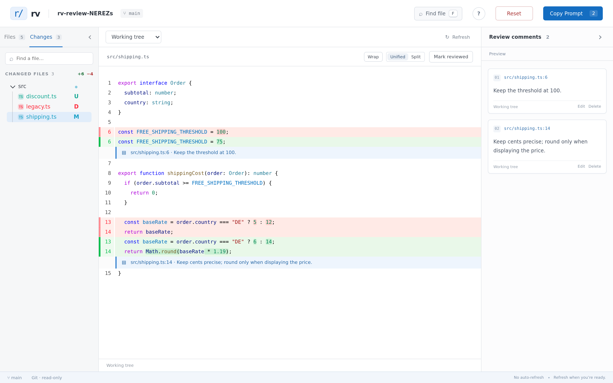
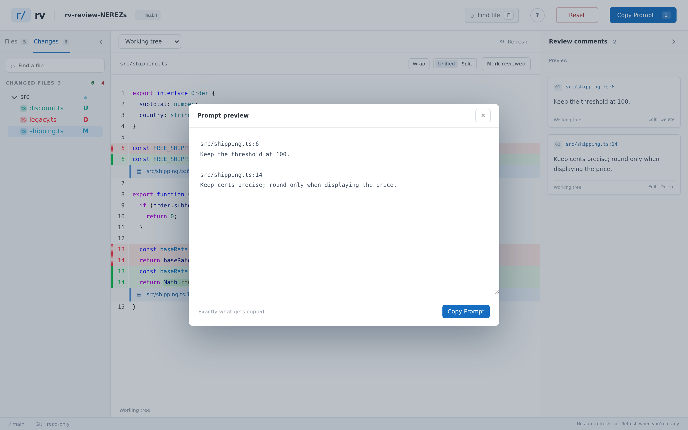

# rv

A small, local code review tool for turning feedback into a prompt for a coding
agent, using [@pierre/diffs](https://diffs.com) and
[@pierre/trees](https://www.npmjs.com/package/@pierre/trees).

There are many tools like this, but this one is customized to my preferences.



## What it does

- Reviews repository files, working-tree changes, recent commits, or a commit
  range in unified or split diffs.
- Attaches comments to individual lines or ranges and gathers them in one place.
- Tracks reviewed files and supports fast, keyboard-driven navigation.
- Copies every comment as a concise prompt with exact file and line references.
- Runs entirely on your machine: no account, database, telemetry, or source-code
  upload.



## Run it

Requires Node.js 22+ and Git.

```sh
npm ci
npm run build
npm link
```

Then run `rv` inside any repository:

```sh
rv
```

rv opens a browser and serves a read-only review UI on localhost. Refresh the
page when you want to load new repository changes; nothing is written back to
the repository.

Cmd-click (Ctrl-click on Windows/Linux) or middle-click a filename to open it
in a new tab. The URL records the selected file and review scope, including
the revisions for a commit or range. Copy or bookmark it to return to that
view; browser Back/Forward also works. Each tab navigates independently.
Opening the bare URL starts in the File Browser; unsubmitted range choices
are temporary and do not survive reload.

In the diff viewer, choose **Diff**, **Old**, or **New** to see the comparison
or the complete file before or after the change. File links preserve this
choice in the URL (`view=diff`, `view=old`, or `view=new`). Comments on Old and
New use that revision's line numbers. Split diffs and expanded unchanged lines
are also preserved in links and browser history.

Your review state (comments, reviewed marks, layout preferences) is cached on local
disk, outside the repository, in one readable directory per opened path —
`~/.cache/rv/--home-you-repo--/state.json` on Linux,
`~/Library/Caches/rv/--Users-you-repo--/state.json` on macOS. It survives
server restarts, page reloads and browser changes. Use Clear to remove comments
and reviewed marks while keeping your view settings.

Open directly on uncommitted changes, a single commit, or a commit range:

```sh
rv --working              # uncommitted changes
rv --commit HEAD          # a single commit
rv --range main..HEAD     # a commit range
```

`--commit` and `--range` accept anything Git understands (branch, tag, short or
full hash). The three options are mutually exclusive.

Use `rv --help` for directory, port, host, and browser options.

### Agent integration

Start rv in agent mode to send review prompts directly to a coding agent:

```sh
rv --agent
```

The review UI shows **Submit to Agent** instead of **Copy Prompt**. Submission
clears the comments after the prompt is accepted, while leaving rv open for
another review. The agent receives one submitted prompt by running:

```sh
rv --wait
```

`rv --wait` prints the prompt to stdout and exits. Run it again to wait for the
next submission. Prompts submitted between calls are queued by the running rv
process. Coding agents can run `rv --skill` for a short description of this
workflow.

## Development

```sh
npm run build
npm test
npm run test:browser
```
